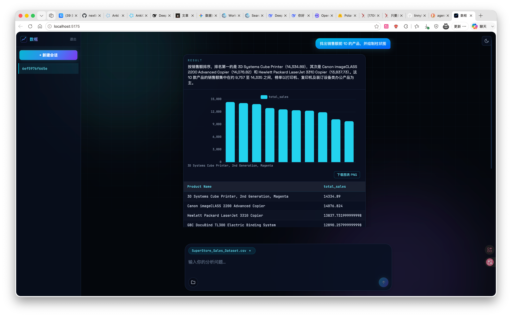
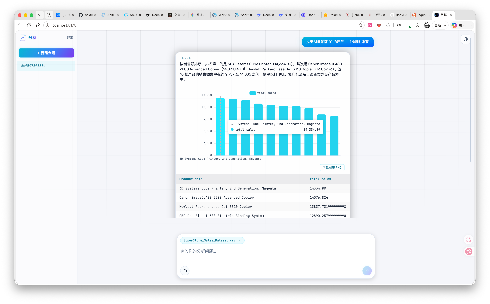

<div align="center">

# 数枢 DataPivot

**对话式数据分析 Agent** —— 上传数据，开口提问，自动分析

[](https://github.com/linnyh/data-agent)
[](https://github.com/linnyh/data-agent)
[](https://github.com/linnyh/data-agent)
[](https://github.com/linnyh/data-agent)
[](https://github.com/linnyh/data-agent)
[](https://github.com/linnyh/data-agent)
[](https://github.com/linnyh/data-agent/actions/workflows/ci.yml)
[](https://github.com/linnyh/data-agent)

</div>

基于 **LangGraph** 的对话式数据分析服务：用户上传数据（csv/json/sqlite/文档/视频简报）
→ 与 Agent 多轮对话澄清需求 → Agent 全自动执行分析（结构化 SQL + 文档抽取 + 视频多模态
三条链）→ 叙述解读 + 结构化表格 + 可视化图表 → 追问迭代。

## ✨ 特性

- 🤖 **对话式分析**：自然语言提问，Agent 自动澄清歧义，全自动执行分析
- 📊 **多模态数据源**：结构化数据（csv/json/sqlite）+ 文档（md/pdf）+ 视频简报，统一注册进 DuckDB 只读查询
- 🔧 **ReAct 求解**：只读 SQL 探查 + 沙箱代码执行，失败自动重试，兜底直跑
- 📈 **自动图表**：解读结果时自动附图（bar/line/pie/scatter），霓虹主题、导出 PNG
- 💬 **多轮记忆**：会话历史注入，支持追问迭代与口径重算
- 🔐 **用户隔离**：bcrypt + JWT，会话级权限（他人会话 403）
- ⚡ **节点级进度**：SSE 实时推送执行阶段
- 🎨 **明暗主题**：深色霓虹 / 浅色，跟随系统，localStorage 持久化

## 🖥 界面预览

<p align="center">
  
  
</p>

## 🚀 快速开始

### 生产模式（单端口：前端 + API 同源）

```bash
uv sync
cd web && npm install && npm run build && cd ..

# 配置写在 .env（已 gitignore）：
#   模型：MODEL_API_URL / MODEL_API_KEY / MODEL_NAME（必填）
#   服务：DATA_AGENT_PORT（默认 8000）/ DATA_AGENT_DATA_DIR（默认 ./data）
python -m data_agent.infrastructure.main    # 浏览器打开 http://localhost:8000
```

### 开发模式（前端热更新）

```bash
python -m data_agent.infrastructure.main    # 终端 1：后端 8000
cd web && npm run dev                       # 终端 2：http://localhost:5173（proxy 到 8000）
```

### 终端对话 CLI（无界面）

```bash
uv run python scripts/chat_cli.py --files 数据.csv    # 或进入后 /upload <文件>
```

## 🏗 架构

```
src/data_agent/
├── domain/            # 纯接口与领域模型（零引擎依赖；SOLID 依赖倒置的根）
│   ├── models.py      # Session / Dataset / AnalysisGoal / Result
│   ├── datasource.py  # IDataSourceRegistry / IDataSourceDescriber
│   ├── solver.py      # ISolver / ISolverSandbox / IScaffoldGenerator
│   ├── pipeline.py    # IDocExtractor / IVideoPreprocessor / IVideoResultJudge
│   ├── judges.py      # IRelevanceJudge（doc/表相关性判定）
│   └── llm.py         # ILLM（模型能力窄抽象）
├── application/       # LangGraph 图 = 用例编排
│   ├── state.py       # PipelineState（checkpoint 持久化状态）
│   ├── graph.py       # clarify → 管线(视频→doc→表→求解) → narrate
│   ├── clarify.py     # 歧义检测 + interrupt/resume
│   └── narrate.py     # 结果叙述解读 + 图表规格
├── adapters/          # 依赖倒置的实现
│   ├── duckdb/        # DuckDB 数据源注册/描述（与内置参考实现逐字节对齐）
│   ├── judges/        # 相关性判定（多轮投票 + 召回优先兜底）
│   ├── pipeline/      # 视频/doc 算法资产 Adapter（模型工厂注入）
│   ├── models.py      # OpenAI 兼容 endpoint（think/nothink 两实例）
│   ├── sandbox.py     # 子进程执行 + 超时 + 内存限制
│   ├── scaffold.py    # solver.py 脚手架生成
│   ├── explore.py     # 只读 SQL 探查工具
│   ├── solver_files.py# hash 定位文件编辑
│   └── solver_agent.py# create_react_agent + attempt 循环
├── assets/            # 内置算法资产（文档结构化引擎、视频预处理组件、评分器等）
└── infrastructure/    # 技术设施
    ├── api/app.py     # FastAPI：auth/sessions/upload/chat(SSE)/result
    ├── auth.py        # bcrypt + JWT + 用户级隔离
    ├── db.py          # 用户/会话持久化（SQLite）
    ├── storage.py     # 会话目录 + 上传分类落盘 + TTL 清理
    ├── checkpoint.py  # AsyncSqliteSaver（thread_id=会话 ID）
    ├── container.py   # 依赖注入根
    └── main.py        # 服务入口

web/                  # React 前端（Vite + TS + Tailwind + ECharts）
scripts/              # 终端对话 CLI
tests/                # 单测 + 冒烟 + 标注集（benchmark/）
```

依赖方向单向：`application → domain ← adapters`；`infrastructure` 组装一切。

## 🔌 API

| 端点 | 说明 |
|------|------|
| `POST /auth/register` | `{username, password}` → `{token, user_id}` |
| `POST /auth/login` | 同上（已注册用户） |
| `POST /sessions` | 创建会话（需 `Authorization: Bearer <token>`，下同） |
| `GET /sessions` | 列出当前用户的会话 |
| `POST /sessions/{id}/upload` | multipart 上传数据文件（csv/json/sqlite/md/pdf/mp4），按扩展名分类落盘 |
| `GET /sessions/{id}/files` | 列出会话已上传文件（路径相对会话目录） |
| `DELETE /sessions/{id}/files?path=` | 按路径删除已上传文件 |
| `POST /sessions/{id}/chat` | `{question, resume?}` → SSE 流：`clarification`（Agent 提问）/ `progress`（执行阶段）/ `result`（叙述+表格+图表）/ `error`；收到 clarification 后带 `resume` 重调续跑 |
| `GET /sessions/{id}/result` | 最近一次分析结果（从 checkpoint 状态读取） |
| `GET /sessions/{id}/history` | 会话历史：每轮问答记录（ADR-0005，checkpoint 为事实源） |

会话间用户级隔离：访问他人会话返回 403，不存在返回 404。

## 🧪 测试

```bash
uv run pytest tests/ -q          # 全量（89 测试）
```

覆盖：领域模型 / DuckDB 与内置参考实现逐字节对齐 / 投票聚合语义 / 求解沙箱三态 /
attempt 循环 / 管线图端到端（fake 注入）/ 对话流（interrupt-resume）/ API 集成与隔离 /
文件列表与删除 / 图表规格下发 / 评分机制。

## 📚 文档

- 术语与领域模型：`CONTEXT.md`
- 架构决策记录：`docs/adr/`（0001 框架选择 / 0002 架构边界 / 0003 认证 / 0004 交互边界 / 0005 历史事实源）
- **设计文档（方案与设计思路）**：`docs/DESIGN.md`
- Agent skills 配置（issue 追踪 / triage 标签 / 域文档约定）：`CLAUDE.md`、`docs/agents/`

## 📊 回归基线

- 离线回归：待离线评测数据与模型 endpoint 就绪后执行分数对标；
- 自建标注集在 `tests/benchmark/`（task_basic / task_filter），评分器实现
  DABench 列签名匹配规范（`src/data_agent/assets/run_compare_to_gt.py`，机制经单测守护）。
