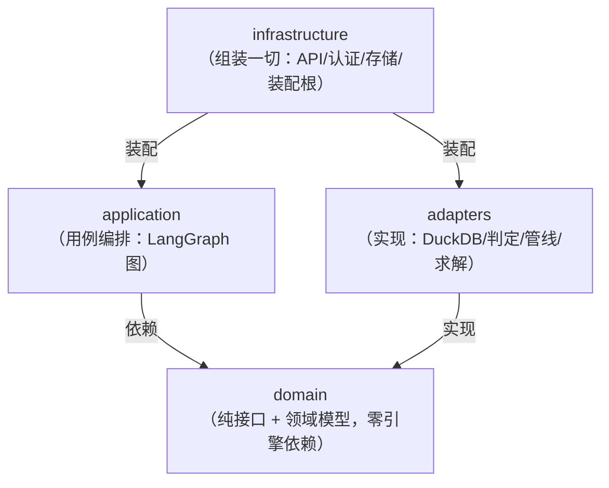
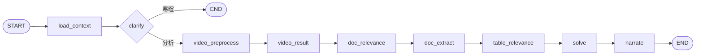
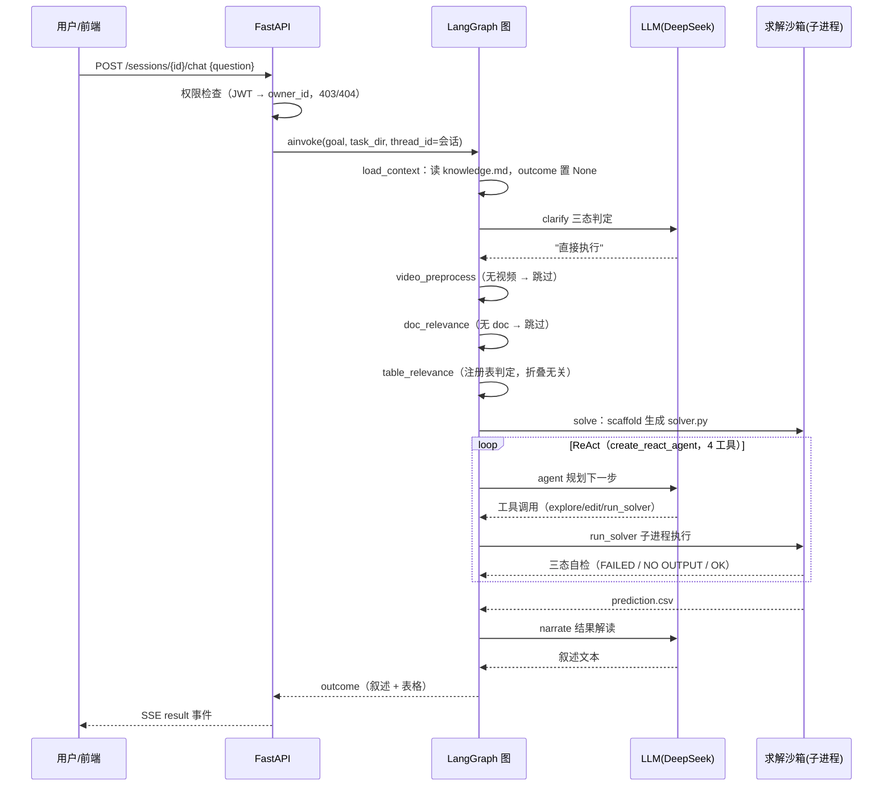
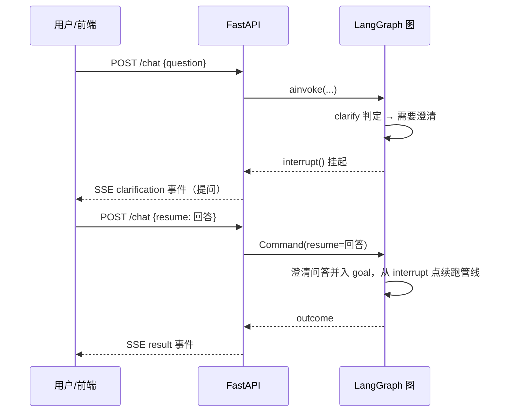

# 数枢（DataPivot）设计文档

> 数枢 —— 对话式数据分析 Agent（LangGraph 重构版）的完整设计说明。
> 本文以"**为什么这么设计**"为主线；术语见 `CONTEXT.md`，决策记录见 `docs/adr/`，
> 实施过程见 `docs/implementation-plan.md`，早期实现原文档见 `docs/TECHNICAL_ARCHITECTURE.md`。

---

## 1. 项目是什么

**一句话**：用户上传数据（csv/json/sqlite/文档/视频），与 Agent 多轮对话澄清需求，
Agent 全自动完成分析（SQL 求解 + 文档结构化抽取 + 视频多模态三条链），
返回叙述解读 + 结构化表格，用户可继续追问迭代。

它以约 1.7 万行代码的早期数据分析管线为基础。
重构的动机（ADR-0001）是**保住实测验证的算法价值，同时解决早期实现的临时性**：
无认证、无隔离、全局状态、路径写死、单机批处理——这些是"演示能用、生产不能"的根源。

## 2. 设计目标与原则

按优先级：

1. **不丢分**：重构后分析质量不低于历史基线。这是第一约束，任何架构决策
   不得牺牲它——由此产生"资产零改动"（ADR-0002）与"逐字节对齐"验收。
2. **SOLID**（用户硬约束）：核心域接口化、依赖倒置、单一职责。早期实现大量违反
   这些原则（模块级全局、直接 import 耦合），但**不是**重写它的理由——见 §4.2。
3. **生产可用**：认证、用户隔离、资源限制、SSE 流式、持久化恢复。这些是早期实现
   完全没有的新增层。
4. **对话式**（用户硬约束）：不是"提交任务拿结果"的黑盒，而是人机多轮对话。
   LangGraph 的 checkpoint + interrupt 恰好是会话状态的天然原语。

## 3. 总体架构：四层 + 单向依赖

**为什么四层**：
- `domain` 是"语言"：`IDataSourceRegistry`、`ISolver`、`ILLM` 等协议 + 会话/数据集/
  结果等领域对象。它不 import 任何引擎/框架（不依赖 duckdb、langchain、fastapi）。
- `application` 用 domain 的语言写用例（图）。它不知道数据在 DuckDB 还是 Postgres、
  模型是 DeepSeek 还是 qwen。
- `adapters` 实现协议：DuckDB 适配器、判定投票实现、内置资产 算法资产桥接。
- `infrastructure` 是依赖注入根：读环境变量，把具体实现装进图，起服务。

**为什么依赖方向必须单向**（application → domain ← adapters）：SOLID 的依赖倒置。
早期实现的问题正是反向依赖——总控 `zz_agent_v2.py` 直接 import 具体工具模块，
换引擎/换模型都要改总控。新架构里替换实现（SQLite→Postgres、DeepSeek→qwen）
只动 infrastructure 装配与 adapters 实现，domain/application 零改动。
这个设计在 M5 的"aiosqlite 死锁 → 换同步 sqlite3"事件中已被实际验证：
换持久化实现只改了 `infrastructure/db.py` 一个文件。

## 4. 核心设计决策（为什么这么设计）

### 4.1 单一大图 + 显式 attempt 循环（共识 #8/#9）

图拓扑：

- **为什么单一大图而非子图**：图的切分边界应跟"状态耦合"走。这些阶段共享同一份
  任务状态（scaffold 文件、relevant_stems、collapse_keys、video_result），拆子图
  要设计跨图状态传递，纯增复杂度。SOLID 的模块边界由 Python 包结构表达，
  不必映射到 LangGraph 子图。
- **为什么 attempt 循环不展开为图边**：solver 的"重试整个对话"语义用 Python
  `for` 循环表达最直接，且与早期实现同构（便于逐行为对比验证分数）。图边回环
  会把"重试"与"ReAct 轮次"混在同一个图层级里，调试时难以区分。
- **为什么 ReAct 循环委托 create_react_agent**：prebuilt 的工具错误回传、步数上限、
  checkpoint 集成是成熟代码，自建要重造轮子还容易丢细节。

### 4.2 核心域重写 + 算法资产 Adapter 零改动（ADR-0002）

**重构边界一刀切在"核心域 vs 算法资产"**：

| 类别 | 模块 | 处理方式 |
|------|------|----------|
| 核心域（生产价值承载） | 数据源注册/描述、SQL 归一、判定投票、求解执行、scaffold | 接口化重写 |
| 算法资产（长期调优产物） | fanout 六阶段抽取引擎、视频链（抽帧/ASR/hiccup/交错）、评分器、prompt 文本 | 原样保留在 `内置资产/`，Adapter 桥接 |

**为什么算法资产不能重写**：fanout_struct 单文件 1667 行，一半是经长期调优的
prompt 模板与硬规则（同义异形名称分列、noise 列尾列、raw/final 双列……）。
重写意味着这些隐性知识全部丢失，行为漂移不可测。SOLID 的答案不是重写一切，
而是用 Adapter 隔离：核心域依赖抽象接口，Adapter 实现之，内置资产 代码成为
"外部库"被消费——依赖倒置恰好成立。

**桥接模式（关键设计）**：构造器注入**模型工厂**而非模型实例。fanout/video 链
的模型协议是 pydantic-ai（内置资产 生态），新核心域是 langchain。不做协议翻译层
（成本高收益低），而是让 Adapter 持有"模型工厂"（默认工厂走 内置资产 环境变量配置，
测试注入 fake）。领域接口不感知 pydantic-ai，依赖倒置成立，内置资产 零改动。

### 4.3 管线全自动，交互只在两端（ADR-0004）

人机交互只发生在管线的两端：

- **前端：clarify**。分析目标有歧义（目标列不明/口径歧义且答案会不同）时
  `interrupt()` 挂起，用户回答后 `Command(resume=...)` 续跑，澄清问答并入目标。
  **为什么宁可不问**：判定失败的兜底是"按可执行处理"——问错问题比多跑一次的
  代价高（打断体验），且管线本身对轻微歧义有容错。
- **后端：narrate**。结果解读（LLM 叙述 + 表格）。**为什么解读失败不阻塞**：
  表格数据才是结果本体，叙述是增强——narrate 异常时保留空叙述，结果不受影响。
- **为什么管线内部零打断**：管线全自动是本方案的核心价值（无需人工干预），
  打断点会让状态机复杂度倍增且破坏该价值。

**三态 clarify（寒暄快速路径）**：意图判定为"寒暄/闲聊/能力询问"时一次 LLM 调用
直接回复，不进管线。这是真实使用中暴露的设计缺口——"你好"最初走完整管线
（3+ 次 LLM 调用、60 秒），修复后 4.9 秒。

### 4.4 追问语义：新调用 vs interrupt（共识 #17）

两种"用户说话"语义不同，用不同机制：

| 场景 | 机制 | 状态 |
|------|------|------|
| Agent 提问等回答 | `interrupt()` 挂起 → `Command(resume)` | 同一 thread 继续执行 |
| 用户发起新分析（"换个口径"） | 新 `ainvoke`（同 thread_id、新 goal） | checkpoint 累积 + 节点幂等 |

**为什么节点要幂等**：追问时图从头跑（START→…→END），但视频预处理、doc 抽取、
表过滤的结果在上一次分析中已算好且未变。幂等检查（`"video_parts" in state` 则跳过）
让追问**只重跑 clarify 和 solve**——视频题追问从几分钟级降到几十秒。

**为什么每轮清 outcome**：checkpoint 累积语义下，上一轮的 `outcome` 残留在 state
里会被 clarify 的条件边误判为"本轮已产出"。`load_context`（每轮新调用的入口节点）
清空 outcome——这是 checkpoint 累积与"每轮独立分析"语义冲突的显式解决。

### 4.5 DuckDB 统一数据源 + 只读白名单

- **为什么所有数据源注册进同一个 DuckDB 连接**：早期实现的核心教训——explore
  探查与 solver 执行若走不同读数据逻辑，"探查通过但执行报错"的漂移会反复出现。
  统一注册 + 统一 SQL 归一（引号方言/列名空格）由**同一份代码**保证 parity。
  新实现里 explore 工具与 scaffold 生成的 solver.py 都走 `DuckDBDataSourceRegistry`。
- **为什么只读白名单并入 run_query**：domain 契约"写操作必须被拒绝"。
  白名单 = 前缀（SELECT/WITH/PRAGMA/DESCRIBE/SHOW/EXPLAIN）+ 写关键词黑名单。
  比 内置资产 更严（内置资产 的 solver.py 路径无白名单）——生产多用户下
  LLM 生成代码必须有执行边界（共识 #20）。
- **为什么 describe 必须逐字节对齐 内置资产**：describe 输出是 solver prompt 的输入，
  任何格式漂移都会改变模型行为——对齐测试（`test_duckdb_parity`）把它固化为验收。

### 4.6 软过滤 vs 硬过滤（召回优先）

- **表相关性判定 = 软过滤**：判定结果**只折叠 prompt 描述**——explore 仍注册全部表、
  scaffold 仍 load 全部表。误判的代价从"答错"降为"多探一步"（SHOW TABLES 找回）。
- **doc 相关性判定 = 硬跳过**：判无关的 doc 不抽取（昂贵）。漏判 = 数据彻底丢失，
  高罚——所以**召回优先**：拿不准判相关、全部失败兜底全相关（`degraded` 语义）。
- **为什么代价不对称设计进协议**：`IRelevanceJudge` 的契约写明"实现失败/超时时
  必须返回 relevant=all_candidates"。兜底行为不是实现细节，是领域语义。

### 4.7 投票聚合算法

前置判定（doc/表相关性、视频答案预判）用并发多轮投票：

- 并发补齐循环：`asyncio.gather` 并发跑 N 轮，失败/超时的轮**不计入但继续补**，
  墙钟≈单轮而非 N×；
- 多数票 + **平票偏召回**（`yes*2 >= n`）；
- 某候选所有成功轮都没判到 → 默认相关（模型遗漏不惩罚召回）；
- 全失败 → 全相关兜底。

**为什么先论证后结论**：判定 schema 字段序为 `name → reason → relevant`，
让弱模型先写依据再下结论，避免"理由说该召回、结论却填 false"的自相矛盾
（实测发生过）。

### 4.8 子进程沙箱 + 资源限制

- **为什么求解必须子进程**：solver.py 是 LLM 生成的代码，进程隔离是最低成本
  的崩溃边界（死循环/段错误不拖垮主进程）。固定命令与路径（无 shell），
  超时 120s，`sys.executable` 保证 venv 依赖。
- **为什么加 RLIMIT_AS 内存限制**：生产多用户下 LLM 代码写死循环吃爆内存是最大
  风险（共识 #20）。默认 4GB（python+pandas+duckdb 导入需 1-2GB 虚拟内存）；
  macOS 不强制 RLIMIT_AS，平台分支跳过。
- **为什么不做容器隔离**：单实例部署期性价比低，接口已预留（ADR 决策 #20 二期）。

### 4.9 模型接入与真实坑

- **think/nothink 两实例**：主求解用 think（推理任务）、判定/抽取用 nothink
  （速度敏感）。两个 `OpenAICompatibleLLM` 实例指向同一 endpoint，仅构造参数不同。
- **真实踩坑（DeepSeek v4-flash，reasoning 模型）**：
  1. 不支持 `response_format=json_schema` → `method="function_calling"`；
  2. thinking 模式不支持强制 tool_choice → **回退链**：function_calling 失败
     自动降级"文本 + JSON 解析"（json_repair 容错，prompt 附加字段清单）。
  这条回退链让任何 OpenAI 兼容端点的结构化输出都可用——通用性优先于最优性。

### 4.10 文件编辑：hashline 定位

read/edit solver 工具是 agent 唯一的文件通道（路径写死 `workdir/solver.py`）：

- 行首 `行号:hash|` 标记，编辑按行号+hash 定位——**为什么**：弱模型记不住行号
  漂移，hash 失配拒绝落盘防止改错位置（实测 39/60 task 首次编辑即失配，
  大多是 end_hash 取成邻近行）；
- 纯字母 hash（monkey-patch 内置资产 hashline）：弱模型会把 "58" 当 int 导致
  pydantic 校验失败；
- 写入前 AST 语法体检，失败回滚并展示**编辑后坐标系**的出错窗口——
  **为什么**：SyntaxError 报的行号是编辑后坐标，而 agent 手上只有编辑前的
  hash，两坐标系无锚点——回显窗口让 agent 眼见为实；
- 编辑成功回传该区域最新 hash 快照——消除"凭旧 hash 连续编辑 → mismatch"死循环。

### 4.11 持久化选择

- **checkpoint = AsyncSqliteSaver**，thread_id=会话 ID（共识 #11）：SQLite 零运维
  先跑通；checkpoint 接口是 LangGraph 标准的，升 Postgres 只换 saver 实现（开闭原则）。
- **业务库（用户/会话）= 同步 sqlite3** + FastAPI `def` 路由走线程池。
  **为什么不用 aiosqlite**：真实踩坑——aiosqlite 连接绑定创建时的事件循环，
  在 TestClient portal 的另一循环中复用直接死锁（M5 调试 30 分钟定位）。
  SQLite 查询微秒级，线程池并发足够；高并发时换 Postgres 是既定替换点。
- **为什么显式允许 checkpoint 序列化类型**：图状态里的 dataclass
  （SolveOutcome/VideoResultAdvice 等）在 strict 模式下会被拒绝反序列化——
  现在显式 allowlist，避免未来版本升级时突然崩。

## 5. 一次对话的完整旅程

以"上传 funds.csv → 问'列出全部基金的规模(亿)'"为例：

**追问**（"换个口径只统计 8 月"）：同 thread 新调用 → load_context/clarify 重跑，
管线节点**幂等跳过**（checkpoint 累积），solve 用新 goal 重跑。

**Agent 提问**（"要哪一列？"）：

## 6. 测试策略：fake 注入的分层验证

**核心哲学：框架逻辑与模型质量分开验证。**

| 层 | 验证什么 | 手段 |
|----|----------|------|
| 对齐测试 | 重写不丢分的第一道防线 | describe 输出与 内置资产 **逐字节相等**；注册表签名一致 |
| 单元（fake LLM） | 投票聚合/attempt/兜底/降级等确定性逻辑 | FakeLLM 可编程返回预设判定 |
| 图测试（fake 组件） | 拓扑/状态流转/interrupt/幂等 | FakeSolver/FakeDocExtractor 等注入 |
| API 集成 | 认证/隔离/SSE 协议 | TestClient + fake 图 |
| 真实模型冒烟 | 端到端质量 | DeepSeek 跑标注集（2 题满分）+ 服务全链路 |
| 离线回归（待办） | 分数对标 | 需离线评测数据 |

**为什么 fake 测试能保证质量**：所有框架行为（图流转、投票、重试、权限、SSE）
是确定性的，fake 注入验证的是"代码逻辑正确"；模型质量（SQL 生成、判定准确率）
由标注集 + 离线回归验证。两者不能互相替代——fake 测试快且稳（守护重构不引入
逻辑回归），真实冒烟慢但验证端到端。

## 7. 已知限制与二期

| 限制 | 原因 | 升级路径 |
|------|------|----------|
| create_react_agent 弃用警告 | langgraph 1.x 仍可用 | 2.0 前迁 `langchain.agents.create_agent`（代码已留注） |
| SQLite 单实例 | 起步存储 | Postgres（checkpoint 与业务库两个替换点） |
| 用户级隔离，无组织共享 | 共识 #23 的一期形态 | owner_id 已就位，权限接口化 |
| 子进程无容器隔离 | 单实例部署性价比 | 执行器接口预留 |
| 离线对标未完成 | 无离线评测数据 | 数据就绪后执行分数对标 |
| 视频题需本地 ASR 模型 | faster-whisper 权重 2GB | `内置资产/.../asr/prepare_models.sh` 下载后生效 |
