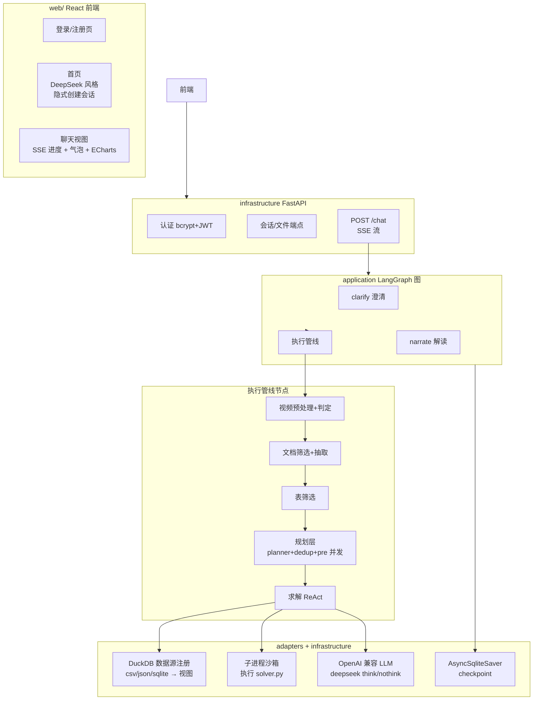
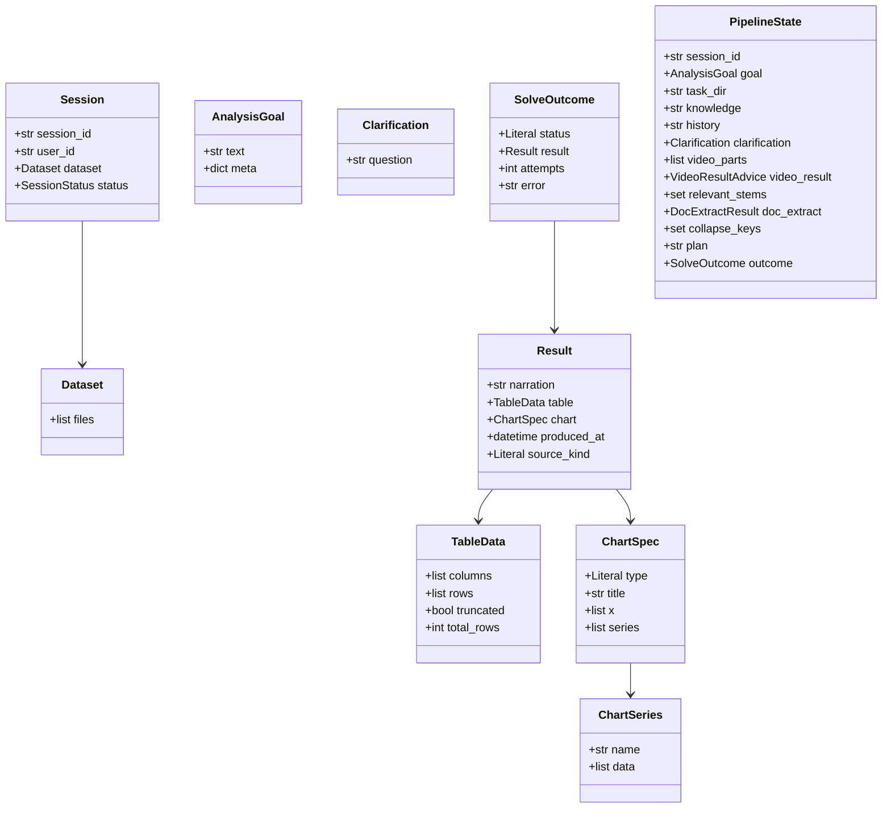
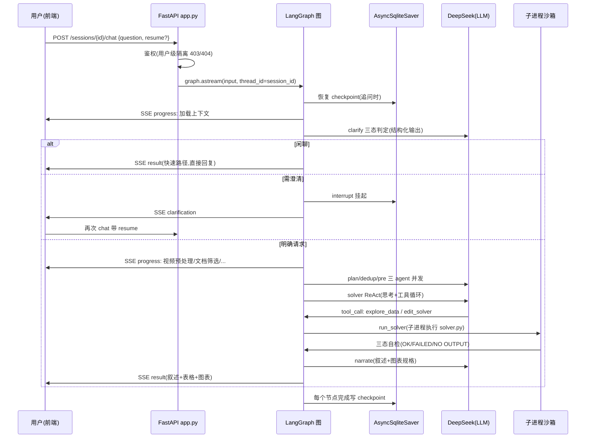
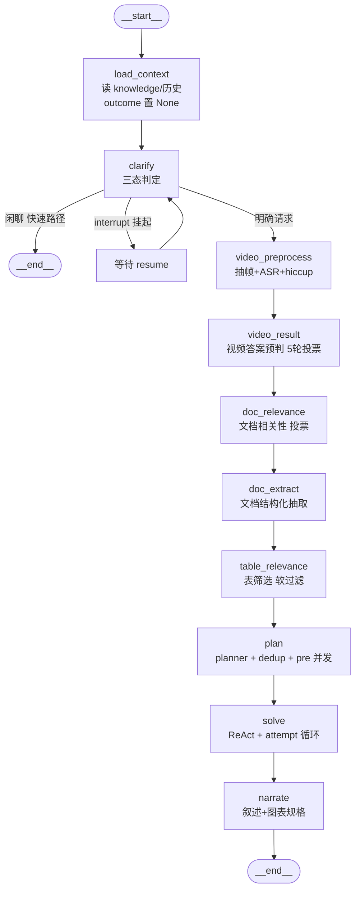
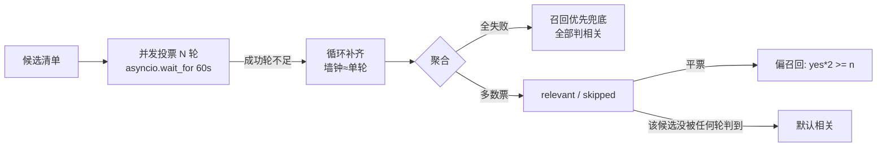
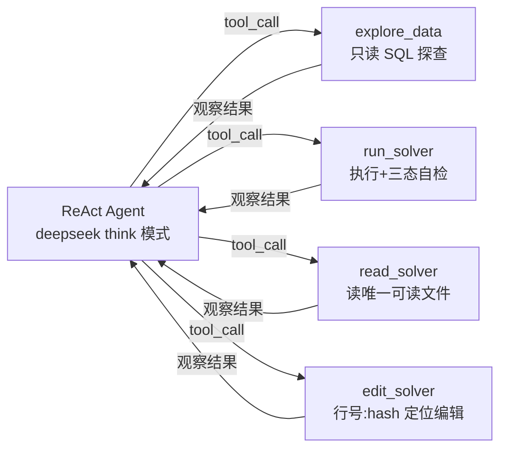
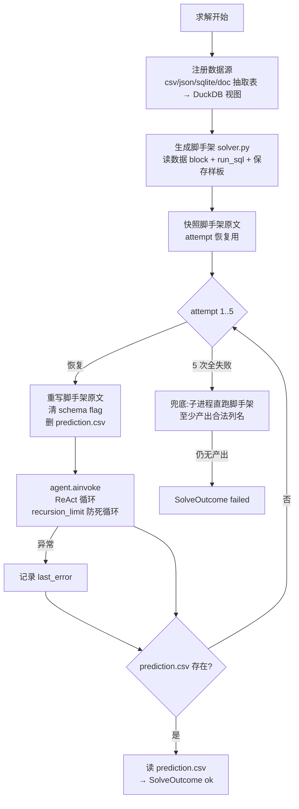
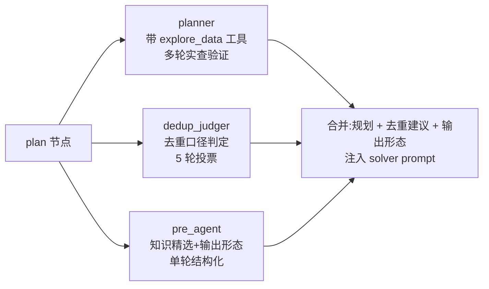
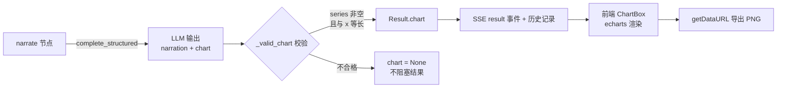

# 数枢(DataPivot)技术深潜:对话式数据分析 Agent 完整技术说明

> 本文面向"彻底吃透"本项目:执行流程、每个节点的输入输出格式、全部提示词、工具调用、领域模型、设计决策。适合作为面试准备材料。
> 术语以 `CONTEXT.md` 为准;架构决策记录见 `docs/adr/`。

## 目录

1. [系统总览](#1-系统总览)
2. [架构分层与依赖倒置](#2-架构分层与依赖倒置)
3. [核心领域模型](#3-核心领域模型)
4. [端到端执行流程](#4-端到端执行流程)
5. [逐节点详解](#5-逐节点详解)
6. [求解器内部:ReAct 循环与工具](#6-求解器内部react-循环与工具)
7. [规划层:三个前置 Agent](#7-规划层三个前置-agent)
8. [数据流:上传→注册→查询](#8-数据流上传注册查询)
9. [会话、记忆与幂等](#9-会话记忆与幂等)
10. [图表规格](#10-图表规格)
11. [API 一览](#11-api-一览)
12. [提示词合集](#12-提示词合集)
13. [可观测性](#13-可观测性)
14. [面试速记:设计决策与兜底策略](#14-面试速记设计决策与兜底策略)

---

## 1. 系统总览

数枢是一个**对话式数据分析 Agent**:用户上传数据(csv/json/sqlite/文档/视频简报),用自然语言提出**分析目标**,Agent 自动完成澄清、规划、求解,交付**结果** = 叙述解读 + 结构化表格 + 可选图表。



一句话架构:**FastAPI 提供会话与 SSE 流式对话;LangGraph 状态图编排管线;求解节点内部是带 4 个工具的 ReAct Agent;所有模型调用走 OpenAI 兼容协议(DeepSeek)。**

---

## 2. 架构分层与依赖倒置

```
src/data_agent/
├── domain/            # 纯接口与领域模型(零引擎依赖)
├── application/       # LangGraph 图 = 用例编排
├── adapters/          # 依赖倒置的实现(duckdb/judges/pipeline/solver/sandbox)
├── assets/            # 内置算法资产(文档引擎/视频组件/子 agent prompt)
└── infrastructure/    # 技术设施(FastAPI/DB/checkpoint/容器装配)
```

核心原则:**SOLID 依赖倒置**。依赖方向单向 `application → domain ← adapters`,`infrastructure` 组装一切。

| 域接口 | 实现 | 说明 |
|---|---|---|
| `ILLM`(llm.py) | `OpenAICompatibleLLM` | 窄抽象:complete_text / complete_structured / as_tools |
| `ISolver` | `LangGraphSolver` | ReAct 求解 |
| `IDocExtractor` / `IVideoPreprocessor` | `AssetDocExtractor` 等 | 桥接内置算法资产 |
| `IPlanner` / `IDedupJudger` / `IPreAgent` | `AssetPlanner` 等 | 前置建议三件套 |
| `IRelevanceJudge` | `DocRelevanceJudge` / `TableRelevanceJudge` | 模板方法:并发投票 |
| `ISolverSandbox` | `SubprocessSolverSandbox` | 子进程 + 超时 + 内存限制 |
| `IDataSourceRegistry` | `DuckDBDataSourceRegistry` | 数据源注册与只读查询 |

替换成本极低:如 checkpointer 换 Postgres 只需改 `build_checkpointer` 工厂(开闭原则)。

---

## 3. 核心领域模型



**术语精确定义**(CONTEXT.md 词汇表):

- **会话**:用户与 Agent 的一段多轮对话,绑定一份数据集,唯一标识 = LangGraph 的 `thread_id`
- **分析目标**:一轮对话中用户提出的具体数据分析问题(Avoid: question/任务)
- **澄清**:执行前因歧义(口径/范围/输出列)向用户发起的提问
- **追问**:用户基于同一数据集看结果后的后续分析
- **结果**:叙述解读 + 结构化表格 + 可选图表三要素
- **图表规格**:图表的声明式描述(类型/类目轴/数据系列),由 Agent 生成,须与表格数据对齐
- **数据集**:上传的数据文件集合(csv/json/sqlite 为**数据源**;md/pdf 为**文档**;briefing.mp4 为**视频简报**)
- **求解**:Agent 编写并运行求解代码,对数据源做 SQL 分析,产出结果表格
- **尝试**:求解的一个执行单元,失败可恢复重试(上限 5 次)

---

## 4. 端到端执行流程

### 4.1 请求生命周期(mermaid 时序)



### 4.2 LangGraph 状态图(mermaid 流程图)



**节点幂等**(追问机制核心):追问 = 新调用、同 `thread_id`。LangGraph 重跑图时,若节点输出已在 checkpoint 中且节点函数返回空 dict,则该节点跳过。因此视频/doc/规划等重计算只跑一次,**追问时只重跑 clarify 与 solve**。所有管线节点都带 `if "xxx" in state: return {}` 守卫。

---

## 5. 逐节点详解

每个节点标注:职责 / 输入 / 输出 / 提示词 / 异常策略。

### 5.1 load_context

| 项 | 内容 |
|---|---|
| 职责 | 加载本轮分析目标的上下文:knowledge.md、会话历史;清空上轮 outcome |
| 输入 | `task_dir`、`goal`、`session_id` |
| 输出 | `{goal, knowledge, history, outcome: None}` |
| 细节 | knowledge 从 `context/knowledge.md` 读;goal 为空时从 `task.json` 回填;**outcome 置 None 是关键**——否则 clarify 的条件边会把 checkpoint 里的旧 outcome 误判为本轮产出 |
| 异常 | 无 LLM 调用,不失败 |

### 5.2 clarify(三态判定 + interrupt)

| 项 | 内容 |
|---|---|
| 职责 | 对用户输入做三态判定;管线前的人机交互(ADR-0004) |
| 输入 | `goal`、`knowledge`、`history`、`context_preview`(FileDescriber 生成的数据集结构预览,截 3000 字符) |
| 输出 | ① 闲聊 → 直接产 outcome(快速路径,不跑管线);② 需澄清 → `interrupt` 挂起 + `Clarification`;③ 明确请求 → 空 dict 直通管线 |
| 结构化 schema | `ClarifyDecision {is_chitchat, reply, need_clarification, question}` |
| 异常 | 判定失败不阻塞(按"可直接执行"处理) |

**interrupt/resume 机制**:clarify 调用 LangGraph 的 `interrupt({"clarification": ...})` 挂起图,checkpoint 保存挂起点。用户带 `resume` 回答后,图从挂起点续跑,澄清问答合并进 goal:

```
goal.text = f"{原始目标}\n\n(澄清问答: 问: {question} 答: {answer})"
```

### 5.3 video_preprocess(视频预处理)

| 项 | 内容 |
|---|---|
| 职责 | briefing.mp4 → 抽帧 + ASR 旁白 + hiccup 版面树 + 时间轴交错的多模态 parts |
| 输入 | `task_dir`、`goal`、`knowledge` |
| 输出 | `{video_parts: [...], video_result: None}`(None=未跑;[]=无视频) |
| 异常 | 失败返回空 parts,不阻塞 |

### 5.4 video_result(视频答案预判)

| 项 | 内容 |
|---|---|
| 职责 | 判定视频面板是否已**直接显示答案**(EXTRACT→ALIGN→DECIDE 三步 + 5 轮投票) |
| 输入 | `task_dir`(读视频 parts) |
| 输出 | `VideoResultAdvice {decision, claimed_values, target_columns, source_frames, distractor_notes, has_video}` |
| 用途 | 仅供 solver 参考:视频看板既可能给"口径"(据此查结构化表),也可能就是"数据源"(看板数值即答案) |
| 异常 | 失败返回 error 字段,不阻塞 |

### 5.5 doc_relevance(文档相关性,硬过滤)

| 项 | 内容 |
|---|---|
| 职责 | 判定哪些 doc 与解题相关;判无关的**跳过抽取**(硬过滤,省 token) |
| 输入 | `doc_dir` 下各文档的候选描述(build_doc_candidates) |
| 输出 | `{relevant_stems: set}` |
| 异常 | 全部投票失败 → 召回优先兜底(所有 doc 全相关);无 judge 注入 → 全相关 |

### 5.6 doc_extract(文档结构化抽取)

| 项 | 内容 |
|---|---|
| 职责 | 相关 doc(md/pdf)→ 结构化表(每 doc 一张同名 sqlite 表,落 `context/db/<stem>.db`) |
| 输入 | `relevant_stems` |
| 输出 | `DocExtractResult {db_path, tables}` |
| 细节 | 抽取表与 csv/json/sqlite **一起注册进 DuckDB**,solver 用 SQL 统一查询;抽取失败降精度/丢字段是已知风险(规划层的"数据质量风险"维度会提醒) |

### 5.7 table_relevance(表筛选,软过滤)

| 项 | 内容 |
|---|---|
| 职责 | 判定哪些数据表与解题相关;判无关的**折叠 describe**(软过滤:不从上下文消失,只是压缩描述) |
| 输入 | 注册后的全部表候选(build_table_candidates) |
| 输出 | `{collapse_keys: set}`(被折叠表的 describe key 集) |
| 异常 | 无 judge → 不折叠;全失败 → 不折叠 |

**投票判定基类**(`_VotingJudge`,模板方法)是 doc/table 两个 judge 的共用核心:



### 5.8 plan(规划层:三个前置 Agent 并发)

| 项 | 内容 |
|---|---|
| 职责 | 求解前产出**合并的解题指引**:解题规划 + 去重口径建议 + 输出形态建议 |
| 输入 | `goal`、`task_dir`、`knowledge` |
| 输出 | `{plan: str}`(三段文本以空行合并;幂等:追问复用) |
| 并发 | 三个 agent 互不依赖,`asyncio.gather` 并发,端到端延迟 = 三者最大值 |
| 异常 | 任一 agent 失败 → 该段为空串,不阻塞 |

详见 [第 7 节](#7-规划层三个前置-agent)。

### 5.9 solve(求解)

详见 [第 6 节](#6-求解器内部react-循环与工具)。

### 5.10 narrate(解读 + 图表规格)

| 项 | 内容 |
|---|---|
| 职责 | 产出叙述解读 + 可选图表规格(一次 LLM 结构化调用) |
| 输入 | `goal`、`outcome.result.table`(前 100 行预览) |
| 输出 | `Result.narration`(文本)+ `Result.chart`(ChartSpec,校验不合格则丢弃) |
| 结构化 schema | `NarrateDecision {narration: str, chart: ChartSpec | None}` |
| 校验 | `_valid_chart`:series 非空且每个系列数据长度 == x 长度;不合格 chart=None |
| 异常 | 解读失败不阻塞:保留空叙述与无图,表格不受影响 |

---

## 6. 求解器内部:ReAct 循环与工具

`solve` 节点是整条管线的核心,实现为 **LangGraph `create_react_agent` + 外层 Python attempt 循环**。

### 6.1 四个工具(唯一能力边界)



| 工具 | 签名 | 作用 | 安全边界 |
|---|---|---|---|
| `explore_data` | `(sql, limit=50)` | 对已注册数据源执行只读 SQL;伪命令 `\tables` / `\schema <表>` | **SQL 白名单**:SELECT/WITH/PRAGMA/DESCRIBE/SHOW/EXPLAIN,禁词黑名单(INSERT/DROP/COPY/...);默认 50 行,上限 500 |
| `run_solver` | `(inspect, head, timeout=120)` | 固定命令 `python3 ./workdir/solver.py`,cwd=任务根,无 shell;回读 prediction.csv 自检 | 固定命令与路径,无法指定其他命令 |
| `read_solver` | `(offset, limit=2000)` | 读 solver.py(唯一可读文件),行首带 `行号:行hash|` 标记 | 只读 solver.py,不接受其他路径 |
| `edit_solver` | `(start_line, start_hash, new_content, ...)` | 按行号:hash 定位编辑(唯一可写文件) | hash 必须来自最近一次 read_solver,连续编辑必须先重读 |

**沙箱三态返回**(`SubprocessSolverSandbox`):

- **FAILED**:脚本非零退出,附折叠后的 traceback
- **NO OUTPUT**:跑通但 result 仍为 None(没写 prediction.csv)
- **OK**:附 shape/列名/各列非空数/前几行(即"保存前自检")

**资源限制**:子进程(非当前进程内)、超时 120s、`RLIMIT_AS` 虚拟内存上限 4GB(环境变量 `SOLVER_MAX_MEM_MB` 可调,0=不限;macOS 跳过)、输出截断 100k 字符、schema 打印折叠、traceback 折叠。

### 6.2 求解主流程



**关键机制**:

1. **attempt 恢复**:每次重试前把 solver.py 恢复为脚手架原貌(防止上一轮残留污染),删除 prediction.csv 与 schema 标记
2. **recursion_limit** = `2 * request_limit + 5`,防止 ReAct 无限循环
3. **兜底直跑**:全部 attempt 失败后,子进程直接执行脚手架(即使查询未实现,也产出合法列名的空结果),保证"任何失败不抛异常,以 SolveOutcome 承载"

### 6.3 脚手架(solver.py)的结构

生成的 solver.py 由三部分组成,LLM 只补全"查询段":

```python
# ① 输入输出路径(不可改)
input_base = Path('./context')
output_base = Path('./workdir')

# ② 数据源读取(不可改):全部注册为 DuckDB 视图
_reg = DuckDBDataSourceRegistry()
_reg.register_directory(Path('.').resolve())

def run_sql(query):
    """执行 SQL 返回 DataFrame;自动处理引号方言与列名空格归一"""
    return _reg.run_query(query)

# ③ 查询段(LLM 补全):把 result 赋为真实查询结果 → pred_df → to_csv
```

**run_sql 与 explore_data 同引擎同实现**——"在 explore_data 里验证通过的 SQL,写进 run_sql 即可执行通过",消除"探查环境"与"执行环境"不一致的经典痛点。

### 6.4 数据源注册(DuckDBDataSourceRegistry)

- csv/json/sqlite 文件**全部注册**进同一个 DuckDB in-memory 连接
- 表名归一(`stem_to_ident`)+ 别名(`df_<canonical>`)
- 只读查询:`run_query` 带 SQL 白名单与禁词黑名单校验
- 中文/含括号表名的空格差异自动归一(手写极易臆造多余空格)

---

## 7. 规划层:三个前置 Agent

plan 节点并发执行三个 agent(各自独立 Adapter,失败空串兜底):



### 7.1 planner(解题规划 Agent)

- **模型**:pydantic_ai Agent + think 模型;带 `explore_data` 工具(多轮 ReAct,上限 40 轮)
- **产出**:markdown plan,按 9 个维度组织(任务复述+口径来源 / 表字段映射 / 筛选条件 / 去重规则 / 单位量纲 / join 键与基数 / 干扰项 / 输出列+预期行数 / 数据质量风险)
- **核心工作方式**:"先查数,再下结论"——去重粒度、单位量纲、join 基数、预期行数必须实查,禁止凭直觉写进 plan
- 视频口径逐条抽取并标注出处帧(slide_xx);禁止查看 gold/答案,禁止无依据的 tie-break

### 7.2 dedup_judger(去重口径判定)

- **模型**:nothink,5 轮并发投票,失败轮忽略
- **产出**:`should_dedup + analysis` → 文本"最终结果**应/不应**按目标输出列去重"
- **判定原则**:看最终输出的**行粒度语义**——唯一对象集合(实体名单)应去重;事件/记录明细、指标观测序列、关系实例、聚合结果不应去重

### 7.3 pre_agent(知识精选 + 输出形态预测)

- **模型**:nothink,单轮结构化输出
- **产出**:
  - `related_use_cases`:与本题 **SQL 形态强对齐**的案例摘录(聚合/排序/join/子查询形态一致 + 表字段重叠,才摘;domain 沾边但 pattern 不同的宁可不摘)
  - `related_field_constraints`:字段语义、编码映射、取值范围、doc 文件指针
  - `output_columns`:预期输出列(**摇摆原则:不确定就加上,缺列扣分多、多列扣分少**)
  - `row_limit`:行数上限(标量聚合=1;显式 top N=N;极值题默认 -1 因可能并列)
  - `task_type`:lookup_filter / aggregate / ranking / ratio / join_complex / other
  - `task_summary`:一句话中文摘要

### 7.4 注入 solver 的最终格式

```markdown
## 解题规划
(planner 产出的 9 维度 markdown)

## 去重口径建议
最终结果**应**按目标输出列去重。
依据: ...

## 相关知识案例
(强对齐 use case 原文)

## 相关字段约束
(编码映射/阈值/指针)

## 输出形态建议
任务类型: aggregate; 预期输出列: month, orders; 行数上限: -1; 任务摘要: ...
```

拼进 solver 的 user prompt(位于 knowledge 与历史之后、"通过完成 solver.py 完成任务"之前)。

---

## 8. 数据流:上传→注册→查询

```mermaid
flowchart LR
    U[上传文件] -->|multipart| API[POST /sessions/id/upload]
    API --> CLS{按扩展名分类}
    CLS -->|.csv .json| CSV[context/csv|json/]
    CLS -->|.db .sqlite| DB[context/db/]
    CLS -->|.md .pdf .txt| DOC[context/doc/]
    CLS -->|.mp4| VID[context/video/briefing.mp4<br/>统一命名]
    CSV --> REG[注册]
    DB --> REG
    DOC --> EXT[doc_extract → context/db/*.db]
    EXT --> REG
    REG -->|DuckDB 视图| QUERY[run_sql / explore_data<br/>只读 SQL 白名单]
    QUERY --> PRED[prediction.csv]
    PRED --> RESULT[Result: 叙述+表格+图表]
```

- **文件管理**:`GET /sessions/{id}/files` 列 context 下真实文件(相对路径);`DELETE /sessions/{id}/files?path=` 按路径删除,`resolve` 后必须落在会话 context 内(防路径穿越)
- **会话目录即隔离边界**:`<data>/<session_id>/context|workdir|task.json`
- **清理**:TTL 过期清理(`storage.cleanup_expired`)

---

## 9. 会话、记忆与幂等

### 9.1 checkpoint 与历史(ADR-0005)

- **checkpoint = 会话历史的唯一事实源**,不建消息表
- `AsyncSqliteSaver`,`thread_id` = 会话 ID;每个节点完成写一次快照
- 序列化:`JsonPlusSerializer` 显式 allowlist 领域类型(Result/SolveOutcome/VideoResultAdvice/...),防 strict 模式拒绝反序列化

### 9.2 历史注入(_read_history)

每轮 `load_context` 从 checkpoint 读历史快照(时间正序),构造摘要:

```
## 会话历史(此前轮次的问答,供理解指代与上下文)
- 问: <goal 前 500 字符>
  答: <narration 前 300 字符>
(最多 20 轮;跳过进行中快照与同 goal 旧轮)
```

注入 clarify 与 solver,实现"换个口径重算"这类指代理解。

### 9.3 多轮与幂等

- **追问**(新 goal、同 thread):管线节点幂等跳过(视频/doc/规划复用),只重跑 clarify + solve
- **resume**(澄清回答):`Command(resume=...)` 从 interrupt 点续跑
- `load_context` 每轮把 outcome 置 None,防止旧结果污染本轮判定

---

## 10. 图表规格



- **ChartSpec**:`{type: bar|line|pie|scatter, title, x: 类目轴, series: [{name, data}]}`
- **生成原则**(prompt 约定):趋势/对比/分布/占比且表格 ≤100 行通常附图;用户显式要求必画;明细清单不画;**数据点必须与表格一致,不得抽样/省略/虚构**
- **前端**:echarts 按需模块引入(bar/line/pie/scatter),项目青蓝紫霓虹主题定制,跟随明暗主题(MutationObserver 监听 html class),ResizeObserver 自适应,导出 PNG(2x pixelRatio)

---

## 11. API 一览

| 端点 | 说明 |
|---|---|
| `POST /auth/register` | `{username, password}` → `{token, user_id}` |
| `POST /auth/login` | 同上 |
| `POST /sessions` | 创建会话(Bearer token) |
| `GET /sessions` | 列出当前用户会话 |
| `POST /sessions/{id}/upload` | multipart 上传,按扩展名分类落盘 |
| `GET /sessions/{id}/files` | 列会话文件(相对路径) |
| `DELETE /sessions/{id}/files?path=` | 按路径删除(防穿越) |
| `POST /sessions/{id}/chat` | `{question, resume?}` → SSE:`progress`(节点级阶段)/ `clarification` / `result`(叙述+表格+图表)/ `error` |
| `GET /sessions/{id}/result` | 最近结果(checkpoint 状态读取) |
| `GET /sessions/{id}/history` | 每轮问答记录(含图表规格) |

**SSE progress 阶段标签**:加载上下文 → 理解需求 → 视频预处理 → 视频内容分析 → 筛选相关文档 → 文档结构化抽取 → 筛选数据表 → **规划解题路径** → 执行分析求解 → 生成结果解读。

**安全**:bcrypt + JWT;用户级隔离(访问他人会话 403,不存在 404);SQL 白名单+禁词;文件路径 resolve 校验;子进程沙箱。

---

## 12. 提示词合集

### 12.1 CLARIFY_SYSTEM(三态判定)

```
你是数枢(数据分析 Agent)的前置意图识别助手。对用户的输入做三态判定:

1. **is_chitchat**: 输入不是数据分析请求——寒暄("你好")、闲聊、询问系统能力
   ("你能做什么")等。此时直接给出简短友好回复(中文, 1-2 句), 不要尝试分析。

2. **need_clarification**: 是数据分析请求, 但目标存在歧义且答案会不同:
   - 目标列/指标不明确;
   - 过滤条件、时间范围、单位、去重规则有多种合理解释。
   需要澄清时 question 必须一句话精确问出歧义点。

3. 两者皆否: 是明确的数据分析请求, 直接执行(轻微模糊不影响执行时宁可不问)。

输出规则: is_chitchat 与 need_clarification 不能同时为 true。

会话历史(如有)记录了此前轮次的问答。闲聊时自然衔接历史;
判断歧义时用历史理解指代(如"换个口径"指的是什么), 不要重复问历史已澄清过的口径。
```

**user 输入格式**:

```
## 分析目标
{goal.text}

## knowledge
{knowledge 前 4000 字符 或 (无)}

## 数据集结构预览
{FileDescriber 预览 或 (未提供)}

## 会话历史
{历史摘要 或 (无)}
```

### 12.2 NARRATE_SYSTEM(解读 + 图表规格)

```
你是数枢的结果解读助手。用户完成一次分析后, 你交付两部分:

1. **narration**: 简洁的自然语言结论。直接回答问题, 点出关键数字, 必要时说明
   口径/范围/异常。2-4 句话即可, 不要复述整个表格, 不要虚构表格里没有的数字。

2. **chart**: 可选图表规格。当结果适合可视化且有助于理解时给出:
   - 分析目标涉及趋势/对比/分布/占比, 且结果表格是聚合后的少量行(≤100 行)时,
     通常应附图; 用户显式要求画图时必画; 明细清单类结果不要画。
   - type: bar(类别对比) / line(时间趋势) / pie(占比, 只允许一个系列) /
     scatter(两个数值维度的散点)。
   - x 是类目轴标签; series 每个系列的数据须与 x 等长, 且只从表格数据中取值。
   - 图表数据点必须与结果表格一致: 不得抽样、不得省略行, 不得虚构表格没有的数字。
   - 只输出与表格对齐的规格, 宁缺毋滥(chart=null)。
```

**user 输入格式**:`## 分析目标\n{goal}\n\n## 结果表格\n{columns + 前 100 行 + total_rows 的 JSON}`

### 12.3 solver 的 system instruction(节选核心条款)

完整版本见 `src/data_agent/assets/agents_v2/solver_agent.py`,核心条款:

1. **目录权限**:`./` 及子目录可读;只有 `./workdir` 可写
2. **数据访问**:全部结构化数据已注册为 DuckDB 视图,必须用 `run_sql(...)` 查询;禁止 `pd.read_csv` 直读原文件、禁止 pandas merge/join 替代 SQL
3. **列选择**:只输出 question 明确要求的字段;多余列扣分;只问"show/retrieve/check 某指标"时默认只输出该指标列,保留原始行集与 NULL,不擅自过滤/排序/去重/LIMIT
4. **题型三分法**(写 SQL 前注释明确口径):
   - 列出原始记录/指标 → 保留行集、重复值、NULL
   - 实体名单("哪些 X qualify")→ 按实体 DISTINCT
   - 聚合/排名/计数 → 视情况 `WHERE ... IS NOT NULL`
5. **极值题考虑并列**:优先 `WHERE col = (SELECT MIN(col) ...)`,而非 `ORDER BY ... LIMIT 1`
6. **视频题**:视频口径(阈值/年份/分组/去重)优先于相似结构化字段;ASR 错别字多,与图像冲突时采信图像/hiccup
7. **文档题**:doc/*.md 已抽取为 sqlite 表(context/db/),一律以抽取表为准
8. **工具纪律**:四个工具各司其职,无 shell/文件浏览;探查走 explore_data,不靠反复跑 solver 试错;edit_solver 的行号:hash 必须来自最近一次 read_solver
9. **保存前自检**:run_solver 的三态返回即自检,据 shape/列名/非空数与题意核对后再结束

### 12.4 PLAN_AGENT_INSTRUCTION(核心条款)

完整版本见 `src/data_agent/assets/agents_v2/plan_agent.py`。核心:

- "先查数,再下结论":去重粒度(COUNT(*) vs COUNT(DISTINCT key))、单位量纲(MIN/MAX 数量级)、join 基数、预期行数、孤儿行——**必须 explore_data 实查,禁止凭直觉**
- 9 维度组织 plan 章节(见 7.1)
- 严格准则:禁止查看 gold/答案;禁止无数据依据的 tie-break/排序/魔法值;数据有歧义时如实记录

### 12.5 DEDUP_JUDGER_INSTRUCTION(核心条款)

- `should_dedup=true`:最终答案是**唯一对象集合/唯一对象答案行**(which/list/哪些/名单/top N 输出实体)
- `should_dedup=false`:事件/记录/明细、指标观测序列(回报率/GDP/成交量)、关系实例(A-B 关系投影)、聚合/单点结果
- 关键原则:看**最终 prediction.csv 的目标输出行粒度**,不看 SQL 表面词;"which/list" 不自动等于去重

### 12.6 PRE_AGENT_INSTRUCTION(核心条款)

- `related_use_cases`:SQL 形态(聚合/排序/join/子查询)与表字段**双重强对齐**才摘;domain 沾边但 pattern 不同的宁可不摘
- `related_field_constraints`:编码映射(1=most severe)、取值范围、单位换算、doc 文件指针
- `output_columns`:摇摆原则(不确定就加,缺列扣分多);拆分原则(first_name+last_name 分别输出)
- `row_limit`:看 SQL 形态定(标量聚合=1;top N=N;极值题默认 -1 因并列)
- `task_type`:lookup_filter/aggregate/ranking/ratio/join_complex/other

---

## 13. 可观测性

- **SSE progress**:节点级阶段,前端实时展示
- **LangSmith**:`LANGSMITH_TRACING=true` + `LANGSMITH_API_KEY`(README 可观测性小节)。solver ReAct 循环与对话层(clarify/narrate)自动追踪(节点/LLM 调用/工具调用/token/延迟);pydantic_ai 资产(规划/判定类)不在自动追踪内
- **checkpoint**:`aget_state_history` 可回放每轮完整状态(history 端点即基于此)

---

## 14. 面试速记:设计决策与兜底策略

### 架构决策(为什么这么设计)

| 决策 | 理由 |
|---|---|
| LangGraph 单一大图 + 节点幂等 | 追问复用已算结果(视频/doc/规划),只重跑 clarify+solve,省大量 token |
| 交互只在管线两端(clarify/narrate) | 管线内部全自动不打断(ADR-0004);人机交互聚焦在语义最需要的地方 |
| checkpoint 即历史事实源 | 不建消息表,历史与状态天然一致(ADR-0005);narrate 前后快照按 goal 归并 |
| 依赖倒置 + 模板方法 | 资产 prompt 复用、模型可换、judge 投票逻辑收敛到 `_VotingJudge` |
| 规划层三 agent 并发 | 规划/去重/输出形态互不依赖,延迟取最大值;失败各自空串兜底 |
| ReAct 只存在于求解节点内部 | 工具不暴露给对话层;用户交互是"目标→结果",求解手段是内部实现 |
| think/nothink 双实例 | 深度推理任务(规划/求解)用 think;判定类(相关性/去重)用 nothink 省延迟 |

### 兜底策略(每一层都有)

| 层 | 失败 | 兜底 |
|---|---|---|
| clarify | 判定失败 | 按"可直接执行"直通 |
| 视频预处理 | 异常 | 空 parts(无视频处理) |
| doc 相关性 | 全投票失败 | 召回优先:全部判相关 |
| 表相关性 | 全失败/无 judge | 不折叠(全量描述) |
| 规划三 agent | 各自异常 | 该段空串,不影响其他段 |
| solve | attempt 全失败 | 子进程直跑脚手架(合法列名的空结果) |
| narrate | 解读失败 | 空叙述+无图,表格不受影响 |
| 图表规格 | 校验不合格 | chart=None,结果照常 |

### 安全设计

- 用户级隔离(bcrypt+JWT;403/404)
- SQL 白名单 + 禁词黑名单(explore_data/run_query 双重校验)
- 子进程沙箱:固定命令、无 shell、超时、内存上限
- 文件系统:hash 定位编辑只作用于 solver.py;上传按扩展名分类;删除 resolve 后必须落在 context 内
- checkpoint 序列化 allowlist,防任意类型反序列化

### 一句话总结面试版

> 数枢是一个 LangGraph 编排的对话式数据分析 Agent:clarify 三态判定实现"闲聊/澄清/直通"分流,澄清走 interrupt/resume;管线依次完成视频多模态预处理、文档相关性与结构化抽取、数据表软过滤,然后**三个前置 Agent 并发**产出解题规划/去重口径/输出形态建议;求解节点内部是带 4 个受控工具(只读 SQL 探查、沙箱执行、hash 定位编辑)的 ReAct Agent,外层 attempt 循环带恢复与兜底;narrate 一次调用产出叙述+图表规格;全部状态以 checkpoint 为事实源,多轮追问靠节点幂等复用计算;每层失败都有兜底,任何异常不阻断结果交付。
