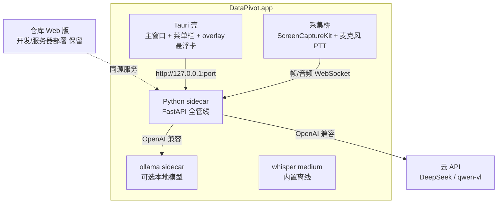

# 数枢桌面化实施计划:Tauri 壳 + Python sidecar

> 状态:计划定稿(2026-09),待实施。产品形态与用户旅程见 `docs/screen-assistant-plan.md`。
> 目标:从零到"实时屏幕助手"macOS App,三阶段递进,每阶段可交付可验证。

## 1. 共识摘要(设计访谈结论)

| # | 决策 | 结论 |
|---|---|---|
| 1 | 壳与 sidecar | Tauri 壳(Rust)+ PyInstaller 打包 Python 服务;前端加载本地 URL,React 零改造 |
| 2 | 端口 | 默认 8765,占用自动 +1;壳从 sidecar 输出读实际端口 |
| 3 | 数据与配置 | `~/Library/Application Support/DataPivot/`(data/ + .env 模板首启生成) |
| 4 | whisper 模型 | 打包进 App(已下载,离线开箱即用) |
| 5 | 签名 | ad-hoc 自用,公证留接口 |
| 6 | 服务入口 | 复用 main.py(环境变量定向数据目录/端口),服务零改动 |
| 7 | 语音触发 | Push-to-talk(⌥+空格),持续聆听二期 |
| 8 | 屏幕采集 | 自写 Rust/Swift ScreenCaptureKit 桥(实施前再验插件生态),帧流走本地 WebSocket |
| 9 | 实时会话 | 新端点 `/live/sessions/{id}/events` + checkpoint `mode: live`;Web 版零影响 |
| 10 | 悬浮卡片 | Tauri overlay 窗口(always-on-top,不抢焦点) |
| 11 | 混合模式 | 主窗口=现有聊天界面;屏幕模式悬浮卡承载,会话历史共享 |
| 12 | 模型 | 云 API 与本地模型**双模式**;本地走 ollama 内置(App 内一键下载/启动) |
| 13 | 里程碑 | M1 桌面化 → M2 半实时 → M3 实时闭环 |

## 2. 目标架构



## 3. 里程碑与任务拆解

### M1 桌面化(1-2 周):双击即用的 App

**目标**:上传文件对话分析以 macOS App 形态运行,零终端操作。

| 任务 | 内容 | 验收 |
|---|---|---|
| 1.1 目录搭建 | `desktop/` 新目录:Tauri 工程 + PyInstaller spec + 打包脚本 | `cargo tauri dev` 可启动空窗口 |
| 1.2 sidecar 打包 | PyInstaller onedir 打包 FastAPI 服务(含 ffmpeg/whisper/duckdb) | 产物可独立运行,`/sessions` 返回 200 |
| 1.3 sidecar 生命周期 | 壳启动拉起进程 → 健康检查 → 窗口加载 URL;退出/崩溃处理 | App 退出后无残留进程;崩溃自动重启一次 |
| 1.4 数据目录迁移 | `DATA_AGENT_DATA_DIR` 指向 AppSupport;.env 模板首启生成 | 首启生成目录与配置模板;重启数据不丢 |
| 1.5 打包与安装 | ad-hoc 签名、.app 产出、dmg 脚本 | 双击 App 完整跑通一次分析 |

### M2 半实时(2-4 周):手动截图 + 语音

**目标**:验证"屏幕内容分析"交互价值,悬浮卡闭环。

| 任务 | 内容 | 验收 |
|---|---|---|
| 2.1 截图输入 | App 内"截取屏幕区域"按钮 → 截图进当前会话上下文 | 截图后可问"这张图里的数据"得到正确分析 |
| 2.2 PTT 语音 | 按住 ⌥+空格录 PCM → 本地 WebSocket 推 sidecar → VAD+whisper 转写 → 填入输入框 | 语音转写准确率可用;松开即发送 |
| 2.3 实时会话端点 | `/live/sessions/{id}/events`:文本+图像混合指令、长 thread 模式 | 连续 10 轮对话状态正确;Web 版回归零影响 |
| 2.4 悬浮卡片 | overlay 窗口渲染结果(摘要+展开表格/图表) | 卡片不抢焦点;点展开进主窗口 |
| 2.5 设置页 | 云 API / 本地模型切换;本地模式 ollama 下载与启动管理 | 两种模式各跑通一次分析 |

### M3 实时闭环(1-2 月):完整 P2

**目标**:持续屏幕帧流 + PTT 语音,边说边看边分析的最终形态。

| 任务 | 内容 | 验收 |
|---|---|---|
| 3.1 帧流采集桥 | Rust/Swift ScreenCaptureKit:5-10fps,画面变化才投递,窗口级选择 | 帧流稳定无泄漏;CPU <15% |
| 3.2 帧流处理链 | sidecar 内:帧差检测 → 关键帧 + hiccup 版面树 → 视觉模型描述 | "看当前屏幕"类指令返回正确内容 |
| 3.3 实时编排 | 语音指令+屏幕上下文 → clarify 路由 → 分析 → 悬浮卡;分析中可打断 | 端到端延迟 <5s;打断体验正常 |
| 3.4 权限引导 | 首次屏幕/麦克风权限引导页 + 用途说明 | 权限拒绝时优雅降级(手动截图模式) |
| 3.5 打磨与发布 | 菜单栏驻留、开机自启选项、dmg 发布、README 桌面章节 | 完整用户旅程走通 |

## 4. 关键技术要点

### 4.1 sidecar 生命周期(壳侧 Rust)

```
启动:Command::new(sidecar).env(DATA_AGENT_DATA_DIR,...).spawn()
      → 读 stdout 解析实际端口(超时 15s 判失败)
就绪:GET /sessions 探活 → 窗口 load URL
退出:App 退出 → kill sidecar(含子进程组);崩溃 → 重启一次 + 日志落盘
```

### 4.2 本地模型(ollama 集成)

- ollama 官方 macOS 二进制作为**第二个 sidecar**,设置页提供:安装/启动/模型列表/一键 `ollama pull qwen2.5-vl`
- sidecar 内 `MODEL_API_URL=http://127.0.0.1:11434/v1` 即切换本地模式(OpenAI 兼容,零代码)
- 视觉模型推荐 qwen2.5-vl(7B,16GB 统一内存 Mac 可跑);文本可继续用云端

### 4.3 实时会话端点

- `POST /live/sessions/{id}/events`:消息类型 `text | image(frame+layout) | command(打断)`,SSE 同款流式返回
- checkpoint `mode: live` 区分长 thread 语义;历史回放按"指令-结果"对归档
- 屏幕上下文不进 checkpoint 全文:只存关键帧引用与版面摘要(防上下文爆炸,与既有 `_summarize` 思想一致)

### 4.4 风险清单

| 风险 | 缓解 |
|---|---|
| ScreenCaptureKit 桥开发比预期难 | 实施 3.1 前先出最小可跑 PoC;失败回退 PTT 手动截图模式(M2 已交付价值) |
| ollama 视觉模型在低配 Mac 延迟大 | 设置页标注硬件建议;云 API 模式为默认 |
| 实时会话与现有 checkpoint 语义冲突 | 新端点+mode 字段隔离;Web 版回归测试守护 |
| App 体积 2-3GB 分发不便 | 自用场景可接受;二期评估按需裁剪(去 pandas-stubs 等) |

## 5. 与 Web 版的边界

- 后端零改动新增(实时端点/ollama 切换均为增量);`/sessions/*` 全部端点行为不变
- 前端零改造:桌面壳与浏览器加载同一份 web 代码,仅新增设置页(桌面特有,壳内路由)
- 仓库 `desktop/` 独立目录;CI 中打包任务独立、不阻塞后端测试
